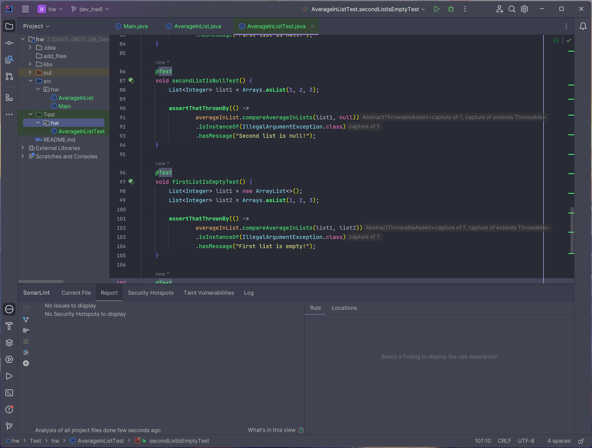
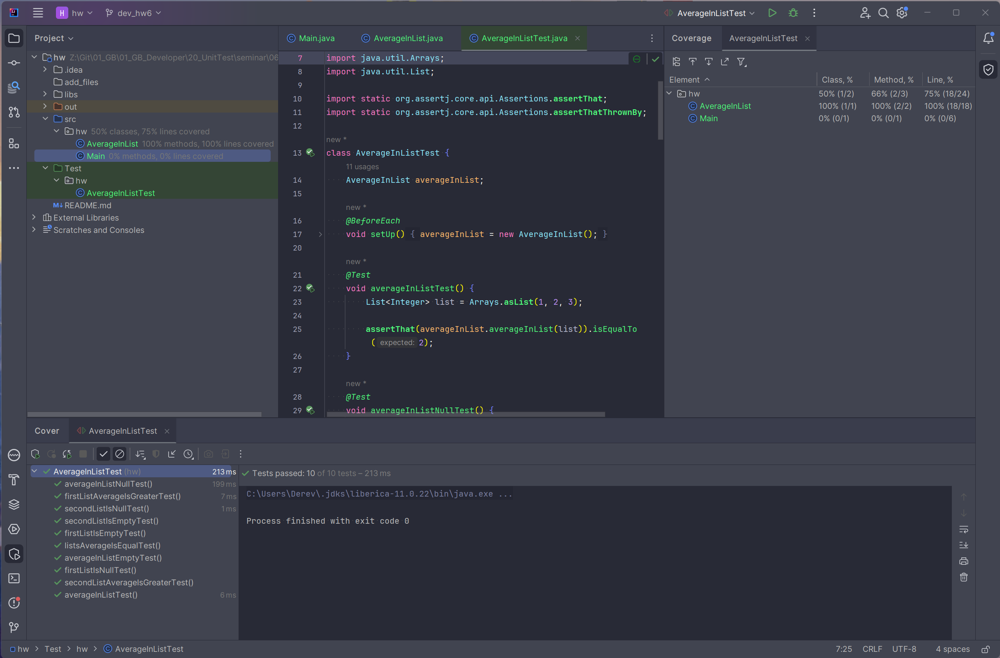

# Курс "Unit-тесты" 
## Домашняя работа 6
* **
### Автор:
Деревянных Алексей
* **
### Примечание:
Программа и тесты написаны на языке *Java*. 
Тесты в файле **[./Test/hw/AverageInListTest.java](./Test/hw/AverageInListTest.java)**
* **

### Условие задачи:
#### Задание 1.
Создайте программу на Python или Java, которая принимает два списка чисел и выполняет следующие действия:
1. Рассчитывает среднее значение каждого списка.
2. Сравнивает эти средние значения и выводит соответствующее сообщение:
   - "Первый список имеет большее среднее значение", если среднее значение первого списка больше.
   - "Второй список имеет большее среднее значение", если среднее значение второго списка больше.
   - "Средние значения равны", если средние значения списков равны.

* Приложение должно быть написано в соответствии с принципами объектно-ориентированного программирования.
* Используйте Pytest (для Python) или JUnit (для Java) для написания тестов, которые проверяют правильность работы программы. Тесты должны учитывать различные сценарии использования вашего приложения.
* Используйте pylint (для Python) или Checkstyle (для Java) для проверки качества кода.
* Сгенерируйте отчет о покрытии кода тестами. Ваша цель - достичь минимум 90% покрытия.

* **

### Описание тестов
Для тестирования программы были реализованы следующие юнит-тесты:
* **averageInListTest** - тест проверяет правильность расчёта среднего значения в списке методом *averageInList*
* **averageInListNullTest** - тест проверяет выбрасываемое исключение метода *averageInList* в случае, когда методу передаётся *null*
* **averageInListEmptyTest** - тест проверяет выбрасываемое исключение метода *averageInList* в случае, когда методу передаётся пустой список
* **firstListAverageIsGreaterTest** - тест проверяет правильность работы метода *compareAverageInLists* в случае, когда среднее значение элементов первого списка больше, чем второго
* **secondListAverageIsGreaterTest** - тест проверяет правильность работы метода *compareAverageInLists* в случае, когда среднее значение элементов первого списка меньше, чем второго
* **listsAverageIsEqualTest** - тест проверяет правильность работы метода *compareAverageInLists* в случае, когда средние значения элементов первого и второго списков равны
* **firstListIsNullTest** - тест проверяет выбрасываемое исключение метода *compareAverageInLists* в случае, когда методу вместо первого списка передаётся *null*
* **secondListIsNullTest** - тест проверяет выбрасываемое исключение метода *compareAverageInLists* в случае, когда методу вместо второго списка передаётся *null*
* **firstListIsEmptyTest** - тест проверяет выбрасываемое исключение метода *compareAverageInLists* в случае, когда методу первый список передаётся пустым
* **secondListIsEmptyTest** - тест проверяет выбрасываемое исключение метода *compareAverageInLists* в случае, когда методу второй список передаётся пустым

Вышеописанный перечень юнит-тестов обеспечивает 100%-ое покрытие класса **AverageInList** тестами и при этом не является избыточным. Интеграционные тесты и сквозные в данной задаче не применяются, так как у класса **AverageInList** не зависимостей от других классов.

* **
##### Отчёт SonarLint

##### Отчёт о покрытии тестами

